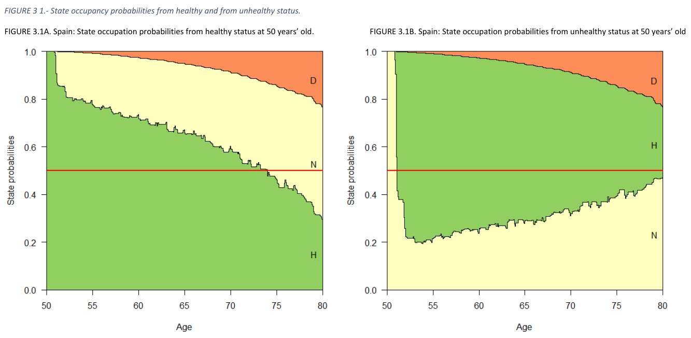

```{r setup, include=FALSE}
knitr::opts_chunk$set(echo = FALSE)
```

## Back-story (I)



\tiny
From Rueda, S. (2019). Health Conditions of the Elderly Population in Europe and Latin America. Methodological Contributions [Unpublished dissertation]. UAB

## Back-story (II)

```{r fig.width=3, fig.height=3,echo=FALSE}
library(png)
library(grid)
img <- readPNG("Figures/Riffe_etal2017.png")
 grid.raster(img)
```

\tiny
From Riffe, T. et. al. (2019). Trends in United States life expectancy above age 50: Delayed onset, improved recovery, mortality change, or compositional change? Repo: [https://github.com/timriffe/HLEDecomp](https://github.com/timriffe/HLEDecomp)

## Questions
\Large

- When to care about initial conditions?
- Good choices for initial conditions?

## Priors on initial conditions
\Large

- faster mixing $\rightarrow$ less important
- larger mortality differences $\rightarrow$ more important

## Toy data

```{r statespace, echo = FALSE,warning=FALSE,message=FALSE}
tools::texi2dvi(here::here('Figures/statespace.tex'),pdf=TRUE,clean=TRUE)
a<-file.rename(from=here::here("statespace.pdf"),to=here::here("Figures/statespace.pdf"))
#system(paste("cd",getwd(), "&& inkscape -l Figures/statespace.svg Figures/statespace.pdf",sep=" "))
knitr::include_graphics(here::here("Figures/statespace.pdf"))
```

## Toy data

```{r fig.width=3, fig.height=3,echo=FALSE}
library(png)
library(grid)
img <- readPNG("Figures/Riffe_etal2017trans.png")
 grid.raster(img)
```

```{r, echo = FALSE, results = "hide", message =FALSE, warning = FALSE}
# helpful for data operations
library(tidyverse)
library(here)
library(reshape2)
# some custom functions
source(here::here("R","Functions.R"))

TR <- readRDS(here::here("Data","TR_v06_collapsed.rds"))

# define a subset
TRsub <- TR %>% filter(sex == "f",
                       edu == "all_edu",
                       time == 2006)

# starting proportions in each state,
# based on observed prevalence around age 50
init_prev <- TRsub[1,c("s1_prop","s2_prop")] %>% unlist()
names(init_prev) <- c("H","U")

# Make the submatrices of U, the transient matrix
U <- sub2U(TRsub)
# N is the fundamental matrix
N <- U %>% 
  U2N()

e50prev  <- N[,c("H::48","U::48")] %*% diag(init_prev) %>% sum() %>% round(2)
e50const <- N[,c("H::48","U::48")] %*% diag(init_constant(TRsub)) %>% sum() %>% round(2)
e50backproj <- N[,c("H::48","U::48")] %*% 
  diag(init_back_proj(TRsub,
       start_age = 40,
       max_age_fit = 65,
       interval = 2)) %>% 
  sum() %>% 
  round(2)

e50backprob <- N[,c("H::48","U::48")] %*% 
  diag(init_back_prob(TRsub, forward_init = init_constant(TRsub))) %>% 
  sum() %>% 
  round(2)

```

## What's at stake?

```{r, echo = FALSE}
x <- seq(48,110,by=2)

# occupancy times (survival curve) depending on health status at start
hsx <- N[1:32,"H::48"]+N[33:64,"H::48"]
usx <- N[1:32,"U::48"]+N[33:64,"U::48"]
# prevalence healthy by age depending on health status at start
hin <- N[1:32,"H::48"] / hsx
uin <- N[1:32,"U::48"] / usx
```

```{r}
plot(x,hsx/2,type = 'l', cex.lab = 1.5,
     ylab = "Aggregate survival",
     xlab = "Age",
     col = "#0d4d91",
     lwd = 2,
     las = 1)
lines(x,usx/2,col="#910d39",lwd=2)
arrows(80,.8,66,(usx["H::66"] + hsx["H::66"]) / 4)
text(80,.8, labels = paste("Gap =",round(sum(hsx) - sum(usx),2),"years"),pos=4,cex=1.5 )
```

## What's at stake?

```{r}
plot(x,hsx/hsx["H::70"],type = 'l', cex.lab = 1.5,
     ylab = "Aggregate survival",
     xlab = "Age",
     col = "#0d4d91",
     lwd = 2,
     las = 1)
lines(x,usx/usx["H::70"],col="#910d39",lwd=2)
points(70,1,pch = 16)
```

## What's at stake?
```{r, echo = FALSE}
plot(x, 
     hin, 
     type = 'l',
     cex.lab = 1.5,
     las = 1,
     xlab = "Age",
     ylab = "Prevalence healthy",
     ylim = c(0,1),
     col = "#0d4d91",
     lwd = 2)
lines(x, uin, lwd = 2, col="#910d39")
polygon(c(x,rev(x)),c(hin,rev(uin)), col = "#9E87BB", border = NA)
```

## 


## Sensitivity (Turnover)

Turnover: onset and recovery considered together.

```{r}
plot(TRsub$age, 
     TRsub$m12, 
     type = 'l',
     cex.lab = 1.5,
     las = 1,
     xlab = "Age",
     ylab = "Turnover",
     ylim = c(0,1),
     col = "#910d39",
     lwd = 2)
lines(TRsub$age, 
     TRsub$m21,
     col = "#0d4d91",
     lwd = 2)
text(102,TRsub$m12[TRsub$age == 102], "Onset", cex = 1.5, col = "#910d39",pos=3)
text(60,TRsub$m21[TRsub$age == 60], "Recovery", cex = 1.5, col = "#0d4d91",pos=3)

```

## Sensitivity (Turnover)

Turnover: onset and recovery considered together, net of mortality.

```{r}
m12sc <- TRsub$m12 / c(TRsub$m12 + TRsub$m11)
m21sc <-  TRsub$m21 / c(TRsub$m22 + TRsub$m21)

plot(TRsub$age, 
     m12sc, 
     type = 'l',
     cex.lab = 1.5,
     las = 1,
     xlab = "Age",
     ylab = "Turnover",
     ylim = c(0,1),
     col = "#910d39",
     lwd = 2)
lines(TRsub$age, 
     m21sc,
     col = "#0d4d91",
     lwd = 2)
text(102,m12sc[TRsub$age == 102], "Onset", cex = 1.5, col = "#910d39",pos=3)
text(60,m21sc[TRsub$age == 60], "Recovery", cex = 1.5, col = "#0d4d91",pos=3)
```

## Sensitivity (Turnover)

Turnover: onset and recovery considered together.

```{r}
# m12sc <- TRsub$m12 / c(TRsub$m12 + TRsub$m11)
# m21sc <-  TRsub$m21 / c(TRsub$m22 + TRsub$m21)

TRsub.512 <- TRsub %>% 
  select(m11,m12,m14) %>% 
  rescale_turnover(.5)
# m12sc.5 <- TRsub.512[,2] / rowSums(TRsub.512[,1:2])

TRsub.521 <- TRsub %>% 
  select(m22,m21,m24) %>% 
  rescale_turnover(.5)
# m21sc.5 <- TRsub.521[,2] / rowSums(TRsub.521[,1:2])

TRsub212 <- TRsub %>% 
  select(m11,m12,m14) %>% 
  rescale_turnover(2)
# m12sc2 <- TRsub212[,2] / rowSums(TRsub212[,1:2])

TRsub221 <- TRsub %>% 
  select(m22,m21,m24) %>% 
  rescale_turnover(2)
# m21sc2 <- TRsub221[,2] / rowSums(TRsub221[,1:2])

plot(TRsub$age, 
     TRsub$m12, 
     type = 'l',
     cex.lab = 1.5,
     las = 1,
     xlab = "Age",
     ylab = "Turnover",
     ylim = c(0,1),
     col = "#910d39",
     lwd = 2)

lines(TRsub$age, 
     TRsub$m21,
     col = "#0d4d91",
     lwd = 2)

lines(TRsub$age, 
      TRsub.512[,2],
     col = "#910d39",
     lwd = 1,
     lty = "44")
lines(TRsub$age, 
    TRsub.521[,2],
     col = "#0d4d91",
     lwd = 1,
     lty = "44")

lines(TRsub$age, 
       TRsub212[,2],
     col = "#910d39",
     lwd = 1, lty = "82")
lines(TRsub$age, 
     TRsub221[,2],
     col = "#0d4d91",
     lwd = 1, lty = "82")

text(78,.6,"double",cex=1.5)
text(84,.05,"half",cex=1.5)
```

## Sensitivity (Turnover)

```{r}
library(colorspace)
library(ggplot2)

init_steps     <- seq(0,1,by=.01)
turnover_steps <- exp(seq(log(.1),log(10),length=101))

e50mat <- matrix(NA,
                nrow = length(init_steps),
                ncol = length(turnover_steps),
                dimnames = list(init_steps = init_steps,
                                turnover_steps = turnover_steps))
compmat <- e50mat * 0
for (j in 1:length(turnover_steps)){
  Ni <- rescale_turnover_U(TRsub, turnover_steps[j]) %>% 
   U2N()
  
  for (i in 1:length(init_steps)){
    Nij          <- Ni[,c("H::48","U::48")] %*% diag(c(init_steps[i], 1 - init_steps[i])) 
    e50ij        <- Nij %>% sum()
    e50mat[i,j]  <- e50ij
    compmat[i,j] <- sum(Nij[1:32,]) / e50ij
  }
}

N <- sub2U(TRsub) %>% U2N()
e50const <- 
  N[,c("H::48","U::48")] %*% diag(init_constant(TRsub)) %>% 
  sum()
e50diff <- e50mat - e50const

e50diff %>% 
  reshape2::melt() %>% 
  rename(e50diff = value) %>% 
  ggplot() + 
  aes(x = turnover_steps, y = init_steps, z = e50diff) + 
  scale_x_log10()+
  geom_tile(aes(fill=e50diff)) + 
  stat_contour(aes(fill=..level..), geom="polygon") + 
  #geom_contour(color="white", alpha=0.5) +
  scale_fill_continuous_diverging("Blue-Red") + 
  theme_bw() + 
  labs(title = "LE diff by turnover scale and initial fraction healthy")+ 
  xlab("turnover scale factor") + 
  ylab("initial fraction healthy") +
  annotate(geom = "point",x=1,y=init_constant(TRsub)[1])

```

## Sensitivity (Turnover)

```{r}
compmat %>% 
  reshape2::melt() %>% 
  rename(compression = value) %>% 
  ggplot(aes(x = turnover_steps, y = init_steps, z = compression)) + 
  scale_x_log10()+
  geom_tile(aes(fill=compression)) + 
  stat_contour(aes(fill=..level..), geom="polygon") + 
  #geom_contour(color="white", alpha=0.5) +
  scale_fill_continuous_sequential("Blues") + 
  theme_bw() + 
  labs(title = "Fraction of LE healthy by turnover scale and initial fraction healthy")+ 
  xlab("turnover scale factor") + 
  ylab("initial fraction healthy") +
  annotate(geom = "point",x=1,y=init_constant(TRsub)[1])
```

## Options for initial composition

- observed prevalence (H = 0.901)
- assume constant in first time step (H = 0.891)
- estimate *backward* probabilities (H = similar)
- back-project, then converge *forward* (H = 0.895)

## Details, constant assumption:

Make a mortality-free 2x2 matrix from the lowest age group:

$$\begin{bmatrix}p(HH) & p(UH)\\
p(HU) & p(UU)
\end{bmatrix}$$

- repeatedly multiply this into a starting population.
- or else take the left eigenvector and rescale it to 1.

## Details, back probability
```{r}

forward_test_vec <- seq(.5,1,by=.01)
back_init_results <- forward_test_vec * 0
for (i in 1:length(forward_test_vec)){
  back_init_results[i] <- 
    init_back_prob(TRsub, 
                   forward_init = c(forward_test_vec[i],
                                    1 - forward_test_vec[i]))[1]
}
# plot(forward_test_vec,back_init_results )
# abline(a=0,b=1)
```

\Large

Based on observation from forward and backward convergence plots:

```{r, fig.width=5, fig.height=4}
pi1 <- proj_prev(initH = rep(1, 32),U)
pi0 <- proj_prev(initH = rep(0, 32),U)
a2  <- seq(50, 112 ,by = 2)
plot(NULL, type = 'n', 
     xlim = c(50,110),
     ylim = c(0,1),
     xlab = "Age",
     ylab = "Prevalence healthy",
     cex.lab = 1.5,
     las = 1)
for (i in 1:32){
  lines(a2[i:32], pi1[row(pi1) == (col(pi1) - 1 + i)], col = "#0000FF80")
  lines(a2[i:32], pi0[row(pi0) == (col(pi0) - 1 + i)], col = "#FF000080")
}
```

## Details, back probability
```{r}

forward_test_vec <- seq(.5,1,by=.01)
back_init_results <- forward_test_vec * 0
for (i in 1:length(forward_test_vec)){
  back_init_results[i] <- 
    init_back_prob(TRsub, 
                   forward_init = c(forward_test_vec[i],
                                    1 - forward_test_vec[i]))[1]
}
# plot(forward_test_vec,back_init_results )
# abline(a=0,b=1)
```

\Large

Based on observation from forward and backward convergence plots:

```{r, fig.width=5, fig.height=4}
  ID <- 
    TRsub %>% 
    IDLT(init = c(.9,.1)) %>% 
    mutate(CDx = 2 - (Hx + Ux),
           Dx = diff(c(0,CDx)), # test
           tr_hhx = hhx * Hx,
           tr_hux = hux * Hx,
           tr_hdx = hdx * Hx,
           tr_uux = uux * Ux,
           tr_uhx = uhx * Ux,
           tr_udx = udx * Ux,
           # reverse probabilities: 
           # (note interstate transfer directions)
           r_hh = tr_hhx / lead(Hx) ,
           r_hu = tr_uhx / lead(Hx),
           r_dh = tr_hdx / lead(Dx), # test
           r_uu = tr_uux / lead(Ux),
           r_uh = tr_hux / lead(Ux),
           r_du = tr_udx / lead(Dx),
           # experiments:
           r_hh = tr_hhx / lead(Hx) ,
           r_hu = tr_uhx / lead(Hx),
           r_dh = tr_hdx / lead(Dx), # test
           r_uu = tr_uux / lead(Ux),
           r_uh = tr_hux / lead(Ux),
           r_du = tr_udx / lead(Dx),
    )
  
  # create projection blocks
  rHH <- rpi2u(rpivec = ID$r_hh[-32], "H", "H")
  rUH <- rpi2u(rpivec = ID$r_uh[-32], "U", "H")
  rDH <- rpi2u(rpivec = ID$r_dh[-32], "D", "H")
  rUU <- rpi2u(rpivec = ID$r_uu[-32], "U", "U")
  rHU <- rpi2u(rpivec = ID$r_hu[-32], "H", "U")
  rDU <- rpi2u(rpivec = ID$r_du[-32], "D", "U")
  
  # compose reverse projection matrix
  rU2 <- rbind(
    cbind(rHH, rUH, rDH),
    cbind(rHU, rUU, rDU),
    matrix(0,nrow=32,ncol=32*3))
  rU2[is.na(rU2)] <- 0
  
  # back-project prevalence (H) from H, U, D
  rpiH <- proj_prev_back(rU2,"H")
  rpiU <- proj_prev_back(rU2,"U")
  rpiD <- proj_prev_back(rU2,"D")
# these need to be different. How many deaths do we add in?
# stationary deaths per age? Interesting catch 22. Deaths per age
# requires an initial mixture! The initial mixture requires deaths
# per age! So looks like an iterative solution would be nice? i.e.
# these back probabilities are just a first approximation! 

# 
a2     <- seq(50,112,by=2)
plot(NULL, 
     type = 'n',
     xlim = c(50,110),
     ylim = c(0,1),
     xlab = "Age",
     ylab = "Prevalence healthy",
     cex.lab = 1.5,
     las = 1)

for (i in 1:32){
  lines(a2[1:(33-i)],rev(rpiH[row(rpiH) + col(rpiH) == (34 - i)]), col = "#0000FF80")
  lines(a2[1:(33-i)],rev(rpiU[row(rpiU) + col(rpiU) == (34 - i)]), col = "#FF000080")
  # lines(a2[1:(33-i)],rev(rpiD[row(rpiD) + col(rpiD) == (34 - i)]), col = "#00000080")
}
```


\tiny 
Brouard (2019) Theory and Applications of Backward Probabilities and Prevalences in Cross-Longitudinal Surveys [https://doi.org/10.1016/bs.host.2018.11.009](https://doi.org/10.1016/bs.host.2018.11.009)

## Details projection back-and-forth

- Covergence is fast if you start close
  - 1. Projected transitions down to age 40
  - 2. Projected prevalence forward to age 50

- $ln(P(H\rightarrow D))$, $ln(P(U\rightarrow D))$

- $ln(\frac{P(H \rightarrow U)}{1 - P(H \rightarrow D) })$

- $logit(\frac{P(U \rightarrow U)}{1 - P(U \rightarrow D) })$

## Details projection back-and-forth
```{r,warning=FALSE}
library(directlabels)
TRsubdown <- down_proj(TRsub)

TRsubdown %>% 
  pivot_longer(cols = m11:m24, 
               names_to = "transition", values_to = "prob") %>% 
  mutate(transition = case_when(
    transition == "m11" ~ "stay healthy",
    transition == "m12" ~ "onset",
    transition == "m14" ~ "die healthy",
    transition == "m22" ~ "stay unhealthy",
    transition == "m21" ~ "recovery",
    transition == "m24" ~ "die unhealthy"
  )) %>% 
  ggplot(aes(x=age,y=prob,color=transition)) + 
  geom_line()+
  coord_cartesian(clip="off") +
  geom_dl(aes(label=transition),method=list(box.color = NA, "angled.boxes"))+
  xlim(40,60) + 
  geom_vline(xintercept=50)+
  theme_bw() +
  guides(color = FALSE)

```

## Summary

- LE sensitive to initial conditions low turnover
- Compression even more sensitive, it seems
- 3 options aside from observed prevalence
- Constant assumption the easiest


